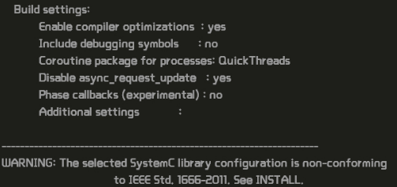
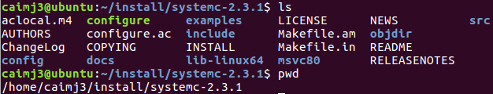
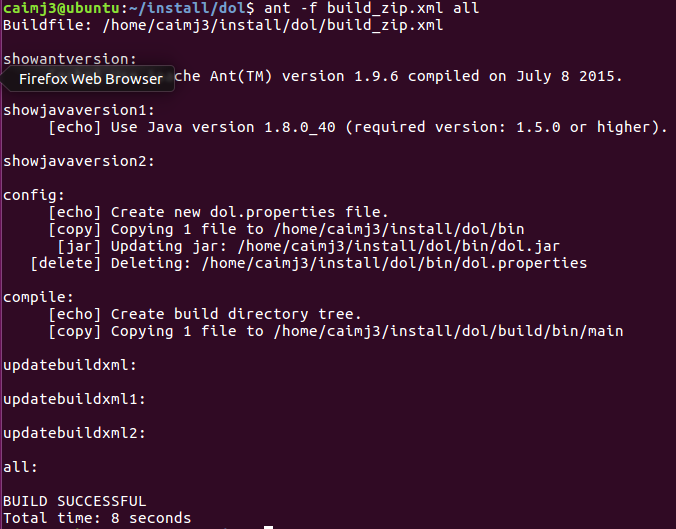

#### Description

###### Distributed Operation Layer(DOL): A framework that enables the (semi-) automatic mapping of applications onto the multiprocessor SHAPES architecture platform.

DOL  consists of threee parts:

+ DOL Application Programming Interface  

  The DOL defines a set of computation and communication routines that enable the programming of distributed, parallel applications for the SHAPES platform. Using these routines, application programmers can write programs without having detailed knowledge about the underlying architecture. In fact, these routines are subject to further refinement in the hardware dependent software (HdS) layer.

+ DOL Functional Simulation

  To provide programmers a possibility to test their applications, a functional simulation framework has been developed. Besides functional verification of applications, this framework is used to obtain performance parameters at the application level.

+ DOL Mapping Optimization 

  The goal of the DOL mapping optimization is to compute a set of optimal mappings of an application onto the SHAPES architecture platform. In a first step, XML based specification formats have been defined that allow to describe the application and the architecture at an abstract level. Still, all the information necessary to obtain accurate performance estimates is contained.

  ​

#### Installation

Requirements：

+ C++ environment: compiler, linker
+ JAVA environment: javac, java
+ Build environment: make, Ant (version 1.6.5 or greater)
+ SystemC environment: version 2.1 or greater

Steps:

1. install ant  <a href="url">About Ant</a>

```linux
$ sudo apt-get install ant
```

​	After entering password, one can install Ant. 

​	

​	Seeing following info means that you have succefully installed Ant.

​	


2. install SystemC

   Get the package "systemc-2.3.1.tgz".			

   

   Unzip it :

```linux
$ tar -zxvf systemc-2.3.1.tgz
```


​	Configure systemC :

```linux
$ cd systemc-2.3.1
$ mkdir objdir
$ cd objdir
$ ../configure CXX=g++ --disable-async-updates 
```

​	Seeing following info means that you have successfully configured systemC.

​	

​	Compile systemC  and record the current execution path :

```linux
$ sudo make install
$ pwd
```

​	The current execution path should have following files, note the current execution path for compiling DOL.

​	


3. install DOL

   Get the package "dol_ethz.zip" and unzip it to a newly created file "dol".

```linux
$ sudo wget http://www.tik.ee.ethz.ch/~shapes/downloads/dol_ethz.zip
$ mkdir dol
$ unzip dol_ethz.zip -d dol
```

​	Edit "build_zip.xml" in dol file : replace YYY with the execution path we get in the step before the last one. If the Linux operation is of 64bit, one should also alter `lib-linux` to `lib-linux64` .

```xml
<property name="systemc.inc" value="YYY/include"/>
<property name="systemc.lib" value="YYY/lib-linux/libsystemc.a"/>
```

​	Compile DOL :

```linux
$ ant -f build_zip.xml all
```

​	Seeing following info means that you have successfully installed DOL.

​	

​	Results may not be the same, for I rebuilt it again. However, one must see "BUILD SUCCESSFUL".


..