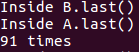

## 死锁

<u>**死锁的定义**</u>：多个进程因等待互相占有的资源而造成的一种僵局。

**<u>死锁产生的条件</u>**：

* 互斥条件：一个资源每次只能被一个进程使用
* 请求与保持条件：一个进程因请求资源而阻塞时，对已获得的资源保持不放
* 不剥夺条件:进程已获得的资源，在末使用完之前，不能强行剥夺
* 循环等待条件:若干进程之间形成一种头尾相接的循环等待资源关系

**<u>Ubuntu上模拟死锁</u>**：

1. 创建两个类A和B，互相调用对方的实例，表示资源的占用：

```java
class A{
    synchronized void methodA(B b){
       b.last();
    }
    synchronized void last(){
       System.out.println("Inside A.last()");
    }
}
```

```java
class B{
    synchronized void methodB(A a){
       a.last();
    }
    synchronized void last(){
       System.out.println("Inside B.last()");
    }
}
```

其中，关键字 **synchronized**是保证同一时刻最多只有一个线程执行该代码。

当线程访问一个实例化了的对象的synchronized同步代码块或同步方法时，其他线程对object中所有其它synchronized同步代码块或同步方法的访问将被阻塞。

2. 写一个deadLock.java，调用A、B类的同步方法来模拟死锁，代码如下：

```java
class Deadlock implements Runnable{
  A a = new A();
  B b = new B();
  Deadlock(){
    Thread t = new Thread(this);
    int count = 2000;
    t.start();//thread t starts
    while(count-->0);//wait 2000
    a.methodA(b);
  }

  public void run(){
    b.methodB(a);
  }
  public static void main(String args[]){
    new Deadlock();
  }
}
```

3. 写一个.sh文件循环调用deadLock.class直至死锁产生。

```sh
#!/bin/bash

for (( c=1; c<=100; c++ ))
do
  echo "$c times"
  java Deadlock
done
```

在命令行键入

```sh
$bash Deadlock.sh
```

在约76次就遇到死锁了：



会产生死锁是因为它满足4个条件：对象a和b分别实例化A类和B类，它们的方法都是设了synchronized的，所以在同一时刻只能运行一个方法，这是满足<u>互斥</u>。deadlock类实现Runnable类，并且它在自身里面创建了一个子线程t调用了start()方法，运行run()函数调用b的同步方法methodB()，传入a的对象又调用a的同步方法last()，此时其他线程对b的last同步方法和a的methodA()的访问会被阻塞，只有当t线程运行完才会被释放，这是<u>不剥夺条件</u>。等待了2000之后又要调用a对象的同步方法methodA()传入b对象调用b的同步方法last()，如果t线程还没释放b对象，那当前线程就获取对象a并保持，这就是<u>请求与保持</u>随后就造成<u>循环等待</u>。