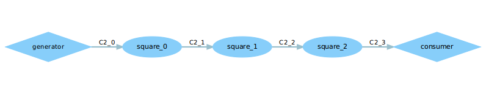
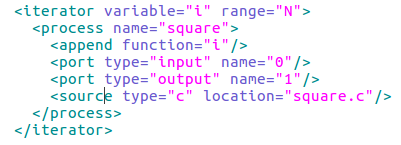
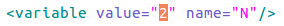
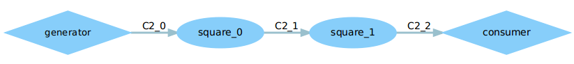
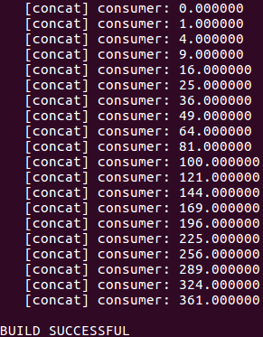
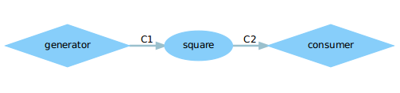
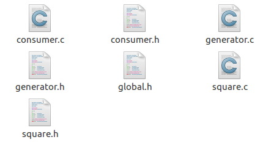
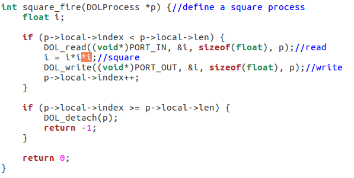
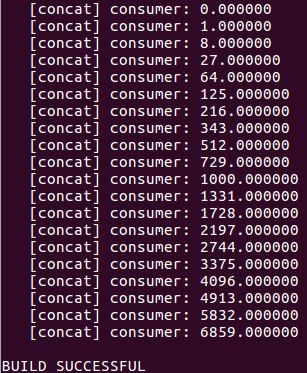

### 任务

1.修改example2,让3个square模块变成2个

2.修改example1,使其输出3次方数

### 思路

1.修改xml的iterator

2.修改square.c

### 实现

1.修改前，example2的dot图是这样的：

有一个生产者generator、一个消费者consumer还有三个square模块，这其实是三种不同的功能模块，不同模块由不同.c、.h文件定义实现，但是有几个模块是由xml文件决定的。来看一下example2.xml：

在example2.xml文件中迭代产生N个square模块，那我们就知道要修改N的大小，把N改成2如下：

重新在命令行执行语句`$sudo ant –f runexample.xml –Dnumber=1`得到结果如下：

2.先来看一下example1的运行结果：

可以看到原先输出的是2次方数。

其拓扑图：

其中包含其中包含生产者、平方模块、消费者【3个框】、通道C1与C2【两条线】。每一个模块都有相应的.c、.h文件定义和实现，最终由xml文件连接起来。源文件如下图：

我们要使example1输出三次方数需要修改square的实现.c文件。将原先代码中的2次方改成3次方即可。

然后进到dol/build/bin/main/中将刚刚运行了的example1文件删除，然后重新在命令行执行

`$sudo ant –f runexample.xml –Dnumber=1`，得到三次方结果如下：

